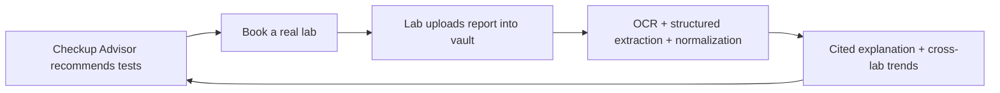
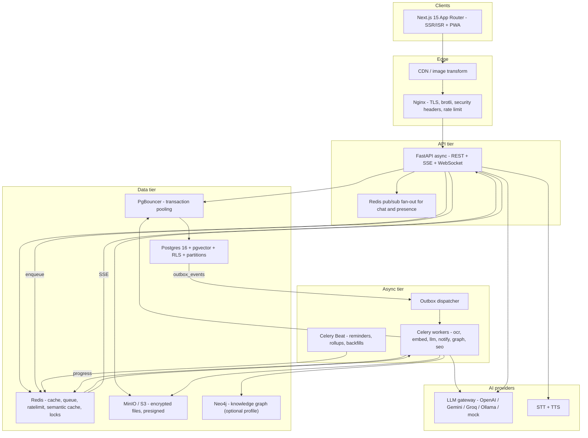
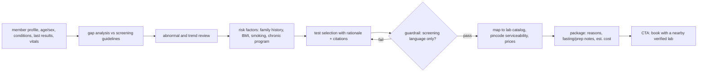

# Aarogya — Full-Stack AI Health SaaS

**Master plan. Single source of truth.** Read this before writing any code.
Companion documents: [AGENTS.md](AGENTS.md) (agent rules), [CONTRIBUTING.md](CONTRIBUTING.md) (git workflow), [docs/](docs/) (screens, data dictionary, error codes, events, copy).

Scope decision: build the real SaaS product first, no 7-day constraint. Doctors and labs are real logged-in users with their own dashboards, bookings, chat and report upload. Assignment #28 is a compliance gate we pass on the way (see section 24), not the ceiling.

This document has been through **three** gap passes (sections 21, 22, 23). Nothing below is aspirational filler — each item is either built or explicitly deferred with a reason.

---

## 1. What we are creating

**Aarogya** — a family health operating system and care marketplace for India.

One platform, four sides, one Postgres:

- **Family (patients)** — family and members, medical profiles, lab report vault, AI report explanation with citations, cross-lab lab-value trends, "what checkup do I need" advisor, vitals and chronic-condition tracking, food logging (search, barcode, photo, natural text), diet and workout plans, medicine and checkup reminders, find and book doctors, find and book lab tests with home collection, teleconsult, chat with linked providers, prescriptions.
- **Doctor** — own login with mandatory 2FA, license verification, public SEO profile, availability with buffers and holidays, appointment inbox, consent-gated patient record view, teleconsult room, consult notes, e-prescription with safety checks, chat, reviews and replies, earnings.
- **Lab** — own login, verification, branches, test and package catalog with city pricing and pincode serviceability, home-collection scheduling with area capacity, booking inbox, phlebotomist assignment, direct report upload into a patient vault (auto-feeds the AI pipeline), amendments and partial reports, SLA tracking.
- **Platform admin** — provider verification queue, catalog curation, content and review moderation, AI guardrail compliance audit, AI quality dashboard, extraction review queue, impersonation with audit, refunds and overrides, feature flags, announcements, platform analytics.

### The wow moment

A family uploads a 6-page PDF lab report. Within seconds it becomes structured, unit-normalized lab values with reference-range flags, a plain-language cited explanation, a trend chart stitched across reports from **different labs**, a red-flag escalation if a value is critical, an AI-recommended checkup package mapped to real verified labs serving their pincode with prices, and a one-click booking — and the AI never diagnoses.

### The compounding loop (the product's spine)



Positioning: *"Your family's health records, understood — and the right doctor, test and meal plan, in one place."*

---

## 2. Roles, tenancy and consent

- Tenant = **family** (`family_id`). Providers are separate tenants (`provider_id`, type `doctor` or `lab`).
- Roles: `family_owner`, `family_admin`, `family_member`, `doctor`, `lab_admin`, `lab_staff`, `phlebotomist`, `platform_admin`, `support_agent`.
- Cross-tenant access happens **only** through an explicit `consent_grant`: scoped to member + record types + purpose + expiry, revocable at any time, every read audited. A doctor with no grant gets `403` even for a patient they have an appointment with, until the patient confirms.
- **Minors and dependents** — under-18 members are guardian-managed; ages 13–17 get a restricted-visibility flag so sensitive categories can be hidden from other family members; on turning 18 the platform prompts account separation and record transfer.
- **Member lifecycle** — a member can be transferred to another family (marriage, separation) carrying their records via a dual-consent handshake, marked deceased (records frozen, read-only), or leave a family with a full export.

---

## 3. Business model

- **Family plans** — Free (limited AI quota, 3 members), Plus, Family Pro (more members, unlimited report Q&A, voice, advisor runs, priority queue).
- **Provider plans** — free listing for verified providers; Growth (clearly labeled featured placement, analytics, more slots); commission or flat fee per completed lab booking.
- Platform take on lab bookings tracked in a commission ledger with payouts.
- **Cost guardrail** — per-plan LLM cost ceiling so a single tenant cannot burn the AI budget.

---

## 4. System architecture



**Hard rule.** Anything over ~300ms (OCR, embedding, report analysis, plan generation, notification fan-out, graph projection) is enqueued and streamed back. HTTP handlers never block on AI.

---

## 5. Monorepo layout

```
aarogya/
├── apps/
│   ├── web/                    # Next.js 15, TS strict, Tailwind, shadcn/ui
│   ├── api/                    # FastAPI
│   │   └── app/
│   │       ├── main.py
│   │       ├── core/           # config, security, tenancy, ratelimit, logging, deps
│   │       ├── db/             # session, rls, base
│   │       ├── models/         # SQLAlchemy
│   │       ├── schemas/        # Pydantic v2
│   │       ├── api/v1/routers/ # thin HTTP layer only
│   │       ├── services/       # ALL business logic
│   │       ├── ai/             # llm, rag, extraction, guardrails, agents, prompts, eval, graph
│   │       ├── tasks/          # Celery tasks
│   │       ├── integrations/   # email, sms, payments, fit, video
│   │       └── migrations/     # Alembic
│   └── worker/                 # Celery entrypoints (imports api package)
├── packages/
│   ├── shared-types/           # OpenAPI -> TS client + zod (generated, never hand-edited)
│   └── ui/                     # shared design-system components
├── infra/
│   ├── docker/  seed/  k6/  prometheus/  grafana/
├── docs/                       # architecture, api, seo, security, runbook, adr/, screens, data-dictionary
├── .github/workflows/          # CI only (Cursor/agent folders stay local)
├── docker-compose.yml  docker-compose.prod.yml  .env.example
├── Makefile
├── PLAN.md  AGENTS.md  CONTRIBUTING.md  README.md
```

---

## 6. Data model

All tenant tables carry `family_id` or `provider_id` and are protected by RLS. Conventions in [docs/data-dictionary.md](docs/data-dictionary.md).

- **Identity** — `users`, `sessions`, `otp_codes`, `totp_secrets`, `backup_codes`, `oauth_accounts`, `recovery_requests`
- **Family** — `families`, `family_members`, `member_medical_profile`, `member_transfers`, `invites`
- **Providers** — `providers`, `doctor_profiles`, `lab_profiles`, `clinics`, `lab_branches`, `provider_documents`, `provider_claims`, `availability_rules`, `availability_exceptions`, `time_slots`, `serviceable_pincodes`, `phlebotomists`
- **Catalog** — `specializations`, `lab_tests` (canonical code, aliases, sample type, fasting, canonical unit, ref ranges by age/sex/state), `test_packages`, `provider_test_prices`, `drugs`, `drug_interactions`, `foods`, `food_aliases`, `food_barcodes`, `portion_units`, `recipes`, `exercises`
- **Records** — `documents`, `lab_reports` (version, supersedes_id, amendment_reason), `lab_results` (raw value + normalized value, unit, ref range from the report, flag, confidence), `vitals`, `chronic_programs`, `prescriptions`, `prescription_items`, `consult_notes`
- **AI** — `doc_chunks` (embedding, embedding_model, page, member_id, report_date), `guideline_chunks`, `ai_conversations`, `ai_messages` (citations, prompt_version, tokens, cost, latency, cache_hit), `guardrail_events`, `extraction_reviews`, `eval_datasets`, `eval_runs`, `prompt_versions`, `semantic_cache_entries`
- **Care** — `appointments`, `appointment_events`, `teleconsult_sessions`, `lab_bookings`, `home_collections`, `sample_events`, `consent_grants`, `consent_access_log`, `chat_threads`, `chat_participants`, `chat_messages`
- **Lifestyle** — `food_logs`, `water_logs`, `nutrition_targets`, `diet_plans`, `workout_plans`, `workout_logs`, `reminders`, `reminder_events`, `health_scores`
- **Trust** — `reviews`, `review_replies`, `review_flags`
- **Platform** — `plans`, `subscriptions`, `usage_counters`, `payments`, `refunds`, `commission_ledger`, `payouts`, `notifications`, `notification_preferences`, `notification_deliveries`, `support_tickets`, `announcements`, `feature_flags`, `api_keys`, `webhook_subscriptions`, `webhook_deliveries`, `blog_posts`, `seo_pages`, `audit_log` (monthly partitions), `outbox_events`, `jobs`, `idempotency_keys`

---

## 7. Core end-to-end flows

### 7.1 Family onboarding

Landing → register (email + password, strength meter) → verify OTP (dev mode prints the code, seed uses a fixed one, so a reviewer is never blocked) → auto-create family shell → four-step wizard (family name; members with relation/dob/gender/blood group/veg preference/allergies/conditions; city and pincode; goals) → tokens issued (access 15m in memory, rotating refresh in httpOnly cookie, all API calls proxied through Next route handlers so **no token ever touches client JS**) → dashboard populated with real content.

### 7.2 Lab report ingestion (the async spine)

```mermaid
sequenceDiagram
  participant U as Family or Lab
  participant A as FastAPI
  participant S as Object storage
  participant Q as Redis
  participant W as Celery worker
  participant D as Postgres
  U->>A: POST /documents/presign (mime, size, sha256)
  A-->>U: presigned PUT + document_id
  U->>S: resumable upload
  U->>A: POST /lab-reports {document_id, member_id, Idempotency-Key}
  A->>D: lab_report(status=queued) + jobs row + idempotency_keys
  A->>Q: enqueue ingest_report
  A-->>U: 202 {job_id}
  U->>A: GET /jobs/{job_id}/stream (SSE)
  W->>S: fetch
  W->>W: magic bytes, AV scan, page cap, password prompt if encrypted
  W->>W: page-aware text layer or OCR fallback (per-page confidence)
  W->>W: LLM structured extraction, schema validated, 3 retries
  W->>W: normalize test codes + units, apply report ref ranges, flag
  W->>W: chunk with page metadata + embed -> doc_chunks
  W->>D: commit; status=ready or needs_review
  W->>Q: outbox report.ready / value.critical
  Q-->>A: stage progress
  A-->>U: "Extracting values 3/4" then ready
```

Failure and edge paths: wrong mime `415`; oversize `413`; encrypted PDF asks for a password; low OCR confidence routes to a **manual confirm** screen plus an admin `extraction_reviews` queue; LLM parse failure after retries still saves text so RAG works and tells the user plainly; worker crash requeues with idempotency preventing duplicates; DLQ with admin retry; **lab amendments** create a new report version that supersedes the old one and recalculates trends with a visible "corrected by lab" badge.

### 7.3 Report understanding (RAG + guardrails)

Question → retrieval **pre-filtered** by `member_id` (never post-filtered) → hybrid pgvector HNSW + trigram → rerank → PII-redacted prompt with a pinned prompt version → streamed answer with inline citations to report page and guideline source → output guardrail (no diagnosis, no dosage, no prognosis, emergency detection) → disclaimer → logged with cost, latency, prompt version, guardrail verdict. Near-duplicate questions return from the semantic cache with a visible cache badge.

### 7.4 Checkup Advisor (LangGraph agent)



Framed explicitly as *"screening suggestions to discuss with your doctor."*

### 7.5 Find a doctor → appointment → consult → prescription

Public ISR page `/doctors/[city]/[specialization]` → filters (specialization, geo radius, language, fee band, experience, availability, rating, verified) with faceted URLs noindexed → hybrid search with the documented ranking formula and a "why recommended" explanation → profile with `Physician` JSON-LD → pick slot → booking request with `Idempotency-Key`, slot held by a Postgres advisory lock plus a unique partial index (no double-booking, even across the doctor's multiple clinics, buffers respected) → doctor accepts, reschedules or declines within an SLA or it auto-expires → on accept the patient grants a scoped consent → consult by teleconsult room or in person, with recorded consent per telemedicine guidelines → consult note plus e-prescription (drug catalog, allergy cross-check against the member profile, interaction warnings, signed PDF with registration number and legal-validity notice) → prescription items auto-create medicine reminders → follow-up reminder → review request only after `completed`.

State machine: `requested → accepted → confirmed → in_progress → completed`, plus `declined`, `expired`, `cancelled_by_patient`, `cancelled_by_provider`, `no_show_patient`, `no_show_provider`. Cancellation windows, reschedule limits and refund rules are policy-driven; every transition is guarded server-side, audited and notified.

### 7.6 Labs page → test booking → report loop

Public `/labs/[city]` and `/tests/[test-slug]/[city]` (price, fasting, turnaround, sample type) → compare labs by price, accreditation, turnaround, home collection → book test or package → home collection slot constrained by area capacity and serviceable pincode, or walk-in → lab confirms, phlebotomist assigned → `sample_events` track collected, received, in-progress, rejected (hemolyzed sample triggers a free recollection flow), partial and final → lab uploads the report directly into the patient vault → 7.2 pipeline runs → patient notified with structured values, cited explanation, updated trends → SLA breach flags the lab in admin.

### 7.7 Chronic care, vitals and reminders

Diabetes and hypertension programs with target ranges, logging cadence, adherence streaks, monthly summary and a doctor-shareable report. Vitals entered manually or imported from Google Fit / Apple Health. Reminders stored in UTC with member timezone, DST-aware Beat scheduling every minute, delivery receipts, snooze/taken/missed feeding adherence stats. Health score is a **deterministic documented formula** (vitals in range, lab flags, adherence, activity, nutrition) with weights shown in the UI; the LLM writes only the explanation, never the number.

### 7.8 Nutrition

Targets from Mifflin-St Jeor plus activity and goal. Logging by search (trigram + aliases), barcode, photo (vision model proposes dish and portion, always an editable confirm step, labeled *estimate*), or natural text ("2 roti and dal"). Indian portion units (katori, roti, glass, tbsp). Veg/vegan/jain toggles, allergy filters, city and season awareness, glycemic index surfaced for diabetic members, pregnancy and child target profiles. Weekly diet plans generated **grounded in the food DB with citations**, condition-aware (diabetic, renal) and budget-aware. Nutrient gap insights connect to labs: *"iron intake low for 5 days; hemoglobin was flagged last month — discuss with your doctor."*

### 7.9 Chat, voice, emergencies

Threads scoped by consent; WebSocket with Redis pub/sub fan-out across replicas; handshake authenticated by a short-lived ticket (never a token in a query string); attachments scanned and capped; no PHI in push payloads. An urgency and sentiment classifier raises an emergency banner with local helpline numbers for red-flag phrasing and refuses to triage beyond "seek immediate care". Voice: press-to-talk → STT → the same RAG and guardrail path → TTS, Hindi or English, always with a text transcript, audio stored only with explicit consent.

### 7.10 Critical value escalation

When extraction flags a `critical` value: the patient gets an in-app + email alert with a "seek care now" banner; any doctor holding an active consent grant is notified in their inbox with an acknowledgement requirement; the event is written to `audit_log`; the admin dashboard tracks unacknowledged criticals. The system never states a diagnosis — only *"this value is outside the critical threshold on your report."*

---

## 8. AI layer

### Techniques and where each lives

| # | Technique | Location | User-visible feature |
|---|---|---|---|
| 1 | Document processing / OCR | `ai/extraction/` | PDF/scan → structured lab values |
| 2 | Advanced RAG (hybrid + rerank + citations) | `ai/rag/` | Report Q&A, guideline Q&A |
| 3 | Guardrails | `ai/guardrails/` | No-diagnosis enforcement, emergency escalation |
| 4 | Agentic workflow (LangGraph) | `ai/agents/` | Checkup Advisor, self-correcting retrieval |
| 5 | Content generation + prompt engineering | `ai/prompts/` | Diet/workout plans, report summaries, consult drafts |
| 6 | Multi-modal vision | `ai/extraction/vision.py` | Food photo logging, report capture |
| 7 | Voice AI (STT + TTS) | `integrations/voice/` | Hands-free Q&A, Hindi/English |
| 8 | Knowledge graph | `ai/graph/` | Member ↔ condition ↔ test ↔ food ↔ doctor traversal |
| 9 | Safe text-to-SQL | `ai/analytics/` | "Show my HbA1c trend" → chart |
| 10 | Semantic caching | `ai/llm/cache.py` | Instant repeat answers, cost badge |
| 11 | Recommendations with explanations | `services/recommend/` | Doctors, labs, foods, next tests |
| 12 | Sentiment / urgency detection | `ai/guardrails/urgency.py` | Emergency banner, escalation |
| 13 | AI evaluation | `ai/eval/` | Quality dashboard, CI regression gate |

### Supporting infrastructure

- **LLM gateway** (`ai/llm/gateway.py`) — one interface; `LLM_PROVIDER` switches OpenAI / Gemini / Groq / Ollama / deterministic mock (so CI needs no key); per-call timeout, retry with jitter, circuit breaker, **fallback chain** primary → secondary → cached/degraded with a user-visible "AI running in reduced mode" state; token, cost and latency accounting per tenant.
- **Prompt registry** — prompts are versioned files loaded into `prompt_versions`; every `ai_messages` row records its prompt version so any answer is reproducible and A/B tests are measurable.
- **Embedding versioning** — `doc_chunks.embedding_model` is mandatory; changing models triggers a backfill job and searches are scoped to one model version so results never silently degrade.
- **Chunking** — page-aware and table-aware, ~800-token chunks with 15% overlap, metadata (member, report date, page, test names) stored for **pre-filtering**.
- **Cost model** — measured cost per report ingest and per advisor run, monthly budget guard with alerting, per-tenant ceilings.

---

## 9. API surface (`/api/v1`)

`auth`, `families`, `members`, `consent`, `providers`, `catalog`, `documents`, `lab-reports`, `ai`, `care`, `chat` (+ `/ws/chat`), `lifestyle`, `reviews`, `notifications`, `jobs`, `billing`, `support`, `admin`, `public`, `meta` (`/health`, `/health/ready`, `/metrics`, `/docs`, `/openapi.json`).

**Conventions** — cursor pagination; `Idempotency-Key` on all creates backed by `idempotency_keys` storing the response snapshot; RFC 7807 `problem+json` with `request_id` and a stable `code` from [docs/error-codes.md](docs/error-codes.md); `X-RateLimit-*` headers; ETag on public reads; strict Pydantic v2 in and out; ORM objects never leaked; OpenAPI is the contract that **generates** the frontend client.

---

## 10. Frontend architecture and UI/UX

**Stack** — Next.js 15 App Router, TypeScript strict, **Tailwind only** (see [AGENTS.md](AGENTS.md) — no `.css` files, no inline styles, no CSS-in-JS), shadcn/ui + Radix, Framer Motion, TanStack Query, react-hook-form + zod (schemas generated from OpenAPI so frontend and backend validation cannot drift), next-intl, next-themes, Recharts, cmdk, sonner.

**Security-critical decision** — the browser never holds a token. Auth lives in httpOnly cookies; all API traffic goes through Next route handlers acting as a thin proxy; `middleware.ts` enforces role-based route access before render.

**Design language** — calm clinical. Deep indigo primary, emerald healthy, amber watch, rose critical. 8pt grid, `2xl` radii, soft shadows. Inter for UI, JetBrains Mono for values, Noto Sans Devanagari subset for Hindi. Semantic tokens only, so dark mode is a token swap.

**Non-negotiable UX rules**

- Mobile-first, verified at 360 / 414 / 768 / 1024 / 1440 / 1920. No horizontal scroll, ever. Bottom nav on mobile, sidebar on desktop. Tables become cards under `md`.
- Every async surface has a skeleton (never a full-page spinner). Every list has an empty state with a CTA. Every error has a human sentence plus retry.
- AI answers stream token-by-token with `aria-live`. Background jobs show named stages. Logs and reminders update optimistically.
- WCAG 2.1 AA — keyboard-complete flows, visible focus, labelled inputs, checked contrast, reduced-motion respected.
- Budgets enforced in CI — LCP < 2.0s, INP < 200ms, CLS < 0.05, route JS < 180KB gzip. Charts, voice and video dynamically imported.
- Feature flags hide anything unfinished. There is never a dead "Coming Soon" button.
- PWA — installable, offline read of cached records, queued offline writes for food/vitals/reminder actions that sync on reconnect.

Full screen inventory with per-screen states: [docs/screens.md](docs/screens.md).

**Design reference material** — [ui.shadcn.com](https://ui.shadcn.com), [tailwindui.com](https://tailwindui.com), [originui.com](https://originui.com), [magicui.design](https://magicui.design), [ui.aceternity.com](https://ui.aceternity.com), [21st.dev](https://21st.dev), [refactoringui.com](https://www.refactoringui.com), [Radix accessibility](https://www.radix-ui.com/primitives/docs/overview/accessibility), [web.dev/vitals](https://web.dev/articles/vitals), [Mobbin](https://mobbin.com).

---

## 11. SEO and GEO

**Technical** — SSR/ISR for public pages with on-demand revalidation when a provider, price or post changes; sitemap index split by type with `lastmod`; robots rules; canonicals; hreflang `en`/`hi`; clean slugs (`/doctors/delhi/cardiologist/dr-ravi-mehta-9f2a`); breadcrumbs; 301 map; AVIF/WebP with alt text; image and video sitemaps; edge caching with stale-while-revalidate; Lighthouse CI budgets.

**Crawl budget protection** — faceted and sorted search URLs are `noindex, nofollow` canonicalized to the clean page; internal search results never indexed; pagination beyond page 5 noindexed; only pages clearing a **content quality gate** (real inventory, real prices, minimum unique content) are indexable — everything else is noindexed rather than shipped as thin content.

**On-page** — unique title/description templates per page type, one `h1`, semantic headings, an internal-link mesh (test → related tests → labs in city → doctors for that condition), FAQ blocks, medical-reviewer byline and last-reviewed date for E-E-A-T, glossary hub.

**Structured data** — `Organization`, `WebSite` + SearchAction, `Physician`, `MedicalClinic`, `MedicalTest`, `Offer` / `AggregateOffer`, `MedicalWebPage`, `FAQPage`, `BreadcrumbList`, `Article`; review markup only where genuine and policy-compliant (never self-serving aggregate ratings).

**GEO / AEO** — `/llms.txt` and `/llms-full.txt`; answer-first 40–60 word paragraphs under question headings; stable citable fact blocks with source and date; machine-readable price and test JSON endpoints; entity consistency across the site and external profiles; scheduled probes that log whether AI answer engines cite us.

**Off-page and local** — Google Business Profile per clinic and branch, NAP consistency, health directory listings, digital PR and guest posts, doctor-authored articles, backlink tracking, review-generation flow after completed appointments.

**Measurement** — GA4 + Search Console + a first-party event table ([docs/analytics-events.md](docs/analytics-events.md)); rank and indexation dashboards; a CI check that fails the build on missing meta, canonical or JSON-LD.

---

## 12. Performance, concurrency and database optimization

**Targets** — 500 concurrent users; p95 < 250ms non-AI reads, < 600ms writes; AI first token < 1.5s. Verified by k6 (smoke, load, stress, soak) against a **100k-row seeded dataset** so indexes are tested realistically, before every release tag.

- Async FastAPI + SQLAlchemy 2 async + asyncpg; Gunicorn with uvicorn workers; **PgBouncer in transaction mode**, which means RLS tenant context must be set with `SET LOCAL` inside each transaction — session-level `set_config` would leak across pooled clients. Recorded as an ADR and covered by a test.
- Zero N+1 — `selectinload` and explicit projections, batched loaders for list screens, and an `EXPLAIN ANALYZE` note required in the PR for every new list endpoint.
- Indexes by design — composite `(family_id, created_at desc)` on hot tables; partial indexes for in-flight job statuses; GIN trigram for names/foods/doctors; GIN on jsonb citations; HNSW on `doc_chunks.embedding` scoped by model version; unique constraints enforcing idempotency and slot exclusivity.
- Partitioning — `audit_log`, `chat_messages`, `ai_messages`, `notification_deliveries` monthly, with a retention job.
- Materialized views for trends, adherence and platform metrics, refreshed concurrently by Beat.
- Caching tiers — Redis for catalogs, facets and public profiles with tag-based invalidation; HTTP ETag/Cache-Control for public pages; semantic cache for LLM; React Query on the client. **Cache stampede protection** via lock plus jittered TTL.
- Rate limits and quotas (Redis token bucket per user, per IP, per endpoint, per API key) — auth 5/min, OTP 3/hour, uploads 20/day free, report Q&A 30/hour free, advisor 5/day free, voice 10/day free, text-to-SQL 20/day, chat 60/min. Each returns `429` with `Retry-After` and a friendly upgrade prompt. Limits live in **one config table**, keyed by plan.
- Backpressure — bounded queues, per-tenant fair-share routing, a priority lane for critical-value reports, DLQ with admin retry.
- Bot protection (Turnstile) on register, OTP, search scraping and review submission.

---

## 13. Security, privacy, compliance and legal

- Argon2id passwords; JWT access 15m; rotating refresh with reuse detection; **TOTP 2FA mandatory for doctor, lab and admin accounts**; backup codes; identity-checked account recovery; device session list and logout-all; re-auth for sensitive actions.
- **Postgres RLS** on every tenant table plus an application tenant guard, with automated proof that family A cannot read family B and that a doctor without consent gets `403`.
- Consent-first sharing with scope, purpose, expiry, revocation and a patient-readable access log.
- Files — private buckets, server-side encryption, short-lived presigned URLs, magic-byte + size + page validation, AV scanning, checksum dedupe. Field-level encryption (pgcrypto) for registration and phone numbers.
- PII redaction before any LLM call; no PHI in notifications, logs or traces; log scrubbing; secrets only via env with rotation notes; gitleaks in CI.
- Headers and hardening — CSP, HSTS, X-Frame-Options, Referrer-Policy, Permissions-Policy, CSRF for cookie flows, CORS allowlist, `bandit`, `pip-audit`, `npm audit`, Dependabot.
- **Medical safety** — a disclaimer on every AI output; never a diagnosis, dosage or prognosis; emergency detection with helplines; a "not a medical device" notice; telemedicine consent recorded for video consults; prescription allergy and interaction checks; guardrail compliance reporting. Approved disclaimer strings live in [docs/copy-guide.md](docs/copy-guide.md) and must be used verbatim.
- **Data rights** — export my data (async zip); delete my account with a documented distinction between what is purged and what is anonymized under medical/financial retention; granular consent toggles; retention schedule; cookie consent; legal pages including terms, privacy, refund and cancellation policy, medical disclaimer, accessibility statement, `security.txt` and a named grievance officer.
- **Backup and DR** — nightly encrypted `pg_dump` plus object-storage sync; documented RPO/RTO; a **restore drill** executed and recorded in `docs/runbook.md` before launch.

---

## 14. Notifications

Outbox-driven notification service with an in-app center; transactional email (i18n templates, SPF/DKIM/DMARC configured); SMS and FCM behind flags; a preference center with per-category channels, quiet hours and digests; one-click unsubscribe for non-transactional messages; `notification_deliveries` with retries and a failure dashboard; a strict no-PHI-in-payload rule.

---

## 15. Observability and operations

Structured JSON logs with a `request_id` propagated into Celery jobs and LLM calls; Prometheus `/metrics`; RED and USE dashboards; an AI dashboard (tokens, cost per tenant, cache hit rate, guardrail firing rate, eval scores); alert rules (queue depth, DLQ size, p95 latency, LLM error rate, cost spike, unacknowledged criticals, SLA breaches); a status page; `docs/runbook.md` with incident severities and comms templates; in-app support tickets and a feedback widget; admin impersonation that is consent-aware and fully audited.

---

## 16. Testing and quality gates

- **Backend** — pytest + httpx async, factory-boy, testcontainers for Postgres/Redis, mock LLM provider. Unit (services, guardrails, extraction parsers, unit conversion), integration (auth, RLS isolation, booking races, idempotency replay, consent enforcement), contract (OpenAPI snapshot + generated-client compatibility). Coverage gate 80% on `services/` and `ai/`.
- **Frontend** — Vitest + Testing Library, MSW, Playwright E2E on deterministic seed for eight critical journeys (register → cited answer; advisor → lab booking; doctor accept → prescription; lab upload → patient notification; food photo log; voice ask; consent revoke blocks access; offline log sync), axe-core assertions, visual regression snapshots.
- **AI** — versioned golden datasets scoring faithfulness, citation accuracy, refusal correctness and extraction field accuracy as a CI gate, plus an adversarial prompt-injection suite that must be 100% blocked.
- **Load** — k6 thresholds on realistic data volume before tagging.
- **Static** — ruff, mypy strict, ESLint, Prettier, TS strict, pre-commit hooks, commitlint.

**Definition of Done per feature (merge blocker)** — API + validation + errors; RLS and consent enforced with a negative test; loading, empty and error states; responsive at all breakpoints; a11y pass; telemetry and audit events; docs and an ADR if a decision was made; seed data; feature flag; migration reviewed for locks.

---

## 17. Git, CI/CD and delivery workflow

Full rules in [CONTRIBUTING.md](CONTRIBUTING.md). Summary:

- Trunk-based with protected `main` (no direct pushes; PR + green CI + review), short-lived branches `feat/…`, `fix/…`, `chore/…`, `docs/…`, one per feature slice.
- Conventional Commits, squash merge, PR template requiring what/why, screenshots, test evidence, rollback notes.
- CI on PR (fast, Turborepo affected-targeting) — lint, typecheck, unit, integration, docker build, E2E on compose, SEO and Lighthouse checks. Nightly (heavy) — AI eval suite, k6 load, full visual regression, dependency and secret audits.
- Alembic expand/contract migrations, one per PR, forward-only, no destructive drop in the same release as a code change, backfills as jobs.
- Semver tags, generated CHANGELOG, ADRs for every significant decision.

---

## 18. Docker, deployment and seed

`docker-compose.yml` — `web`, `api`, `worker`, `beat`, `postgres` (pgvector), `pgbouncer`, `redis`, `minio` + `createbuckets`, `nginx`, `mailhog`. Optional profiles: `graph` (neo4j), `local-ai` (ollama + local whisper), `observability` (prometheus + grafana), `video` (teleconsult SFU). Healthchecks with `depends_on: service_healthy`, named volumes, entrypoint runs `alembic upgrade head` then an idempotent seed.

`docker-compose up -d` must yield a fully working product in **under 5 minutes** with **one** required secret (`LLM_API_KEY`); with no key at all the mock provider keeps the app usable. `.env.example` documents every variable, its purpose and where to obtain it. `make dev|test|seed|reset|load-test|eval`.

Production compose adds Gunicorn tuning, TLS, log rotation and backup cron; target a single VPS first with documented notes for splitting web, api and worker tiers.

**Seed data** (`infra/seed/`) — demo family `demo@aarogya.app / Demo@1234` with 4 members; 3 already-processed reports **from two different labs** (proving unit normalization and trends); 1 report deliberately needing manual confirm; 12 verified doctors across 4 cities; 6 labs with priced catalogs (80+ tests, 10 packages, pincode coverage); 300+ Indian foods with sourced macros and portion units; 2 appointments; 1 lab booking with home collection; 1 chat thread; 1 prescription with reminders; reviews; plus `doctor@aarogya.app`, `lab@aarogya.app`, `admin@aarogya.app`. A reviewer sees a living product on first load.

---

## 19. Walking skeleton (build this before breadth)

Before any breadth work, prove the architecture end to end with the thinnest possible vertical slice, deployed in Docker:

**register → login → upload one PDF → job runs in worker → chunks embedded → ask one question → cited answer streams back → disclaimer shown**

If that works in Docker with real containers, every later milestone is incremental. If it does not, no amount of feature breadth will save the project. This is the exit criterion for M6.

---

## 20. Milestone roadmap

Each milestone is an independently shippable, demoable slice on its own branch with a PR and green CI. Order is dependency-driven, not date-driven.

| # | Milestone | Branch | Exit criterion |
|---|---|---|---|
| M0 | Foundation | `chore/bootstrap` | `docker-compose up -d` boots green from clean state; CI passes |
| M1 | Identity and tenancy | `feat/auth` | Cross-tenant negative tests pass; 2FA works for providers |
| M2 | Family core | `feat/family` | Members, profiles, invites, transfers, guardian rules |
| M3 | Design system | `feat/design-system` | Four role shells, all states, a11y + budget gates in CI |
| M4 | Async spine | `feat/documents` | Presigned upload, jobs + SSE, outbox, DLQ, idempotency replay |
| M5 | Report intelligence | `feat/report-ai` | Extraction with confidence, normalization, versioning, trends |
| M6 | RAG and guardrails | `feat/rag-guardrails` | **Walking skeleton (section 19) green** |
| M7 | Provider platform | `feat/providers` | Onboarding, verification queue, claims, availability |
| M8 | Discovery and search | `feat/search` | Hybrid search, ranking formula, serviceability, noindexed facets |
| M9 | Care transactions | `feat/appointments`, `feat/lab-bookings` | No double-book under concurrent load; full booking lifecycle |
| M10 | Consultation loop | `feat/consult` | Consent-gated view, teleconsult, prescription safety checks |
| M11 | Checkup Advisor | `feat/checkup-advisor` | Cited package → one-click booking. **Assignment-ready** |
| M12 | Vitals and chronic care | `feat/vitals-chronic` | Programs, adherence, device import, deterministic score |
| M13 | Nutrition | `feat/nutrition` | Search, barcode, photo, text logging; grounded plans |
| M14 | Workout | `feat/workout` | Condition-aware plans, logging, progress |
| M15 | Reviews and trust | `feat/reviews` | Eligibility-gated reviews, moderation, replies |
| M16 | Notifications | `feat/notifications` | Preference center, quiet hours, delivery log, no PHI |
| M17 | Voice and i18n | `feat/voice-i18n` | Hindi/English UI + voice with transcript fallback |
| M18 | Graph and analytics | `feat/graph-analytics` | Graph projection with degradation; safe text-to-SQL |
| M19 | Billing and quotas | `feat/billing` | Plans, usage counters, cost ceilings, payouts |
| M20 | SEO and marketing site | `feat/seo` | Programmatic pages behind quality gate; CI SEO check |
| M21 | Platform ops, support, legal | `feat/platform-ops` | Impersonation, tickets, legal pages, export/delete |
| M22 | Public API and webhooks | `feat/public-api` | Scoped keys, HMAC webhooks, replay, sandbox |
| M23 | Hardening and load | `feat/hardening` | k6 at 500 concurrent on 100k rows; chaos cases; restore drill |
| M24 | Submission package | `docs/submission` | README, screenshots, video, clean-state Docker verified |

**Assignment-ready checkpoint** — every mandatory requirement is satisfied from **M11 onward**. Submission can be triggered any time after M11 by executing M24, with remaining milestones documented as roadmap.

---

## 21. Gap pass 1 — product and domain (found and fixed)

1. Original HTML was a spec, not a product → rebuilt as a Next.js app; HTML kept only as `docs/legacy-spec.html`.
2. Doctors and labs were cards with a "future claim" → real accounts with verification, dashboards, bookings, chat, direct upload.
3. No provider acquisition path → self-serve onboarding plus a **claim-your-profile** flow for seeded listings, with verification to prevent hijacking.
4. No trust layer → reviews restricted to completed appointments, provider replies, moderation, spam detection, so rating markup is genuine.
5. Search ranking undefined → documented formula (verified, rating, distance, price, response rate, completion rate, recency, personalization) with clearly labeled sponsored slots.
6. No notification infrastructure → outbox-driven service, preference center, quiet hours, digests, delivery log, deliverability setup.
7. i18n existed only for voice → full app localization with next-intl, Devanagari subsetting, locale-aware AI output.
8. Minors, guardians, deceased members and family splits undefined → guardian management, age-based restricted visibility, dual-consent transfer, frozen records.
9. No 2FA or recovery despite handling PHI → mandatory TOTP for providers/admins, backup codes, identity-checked recovery.
10. No teleconsult in a 2026 health marketplace → video room with recorded telemedicine consent, behind a Docker profile.
11. Booking policy vacuum → cancellation windows, reschedule limits, no-show handling, auto-expiry, buffers, holidays, cross-clinic conflict prevention.
12. Lab reports treated as immutable → report versioning, amendments with reasons, partial reports, sample rejection, free recollection.
13. Trends would silently break across labs → canonical test-code normalization, unit conversion, per-report reference ranges, explicit cross-lab caveat.
14. E-prescription had no safety layer → drug catalog, allergy cross-check, interaction warnings, signed PDF with registration number and legal notice.
15. Critical values detected but nothing happened → full escalation policy with patient alert, consented-doctor notification, acknowledgement tracking, admin oversight.
16. No vitals or chronic care (the highest-retention health feature) → vitals, diabetes and hypertension programs, adherence, device import.
17. Food logging unrealistic for India → barcode scanning, Indian portion units, water and meal timing, glycemic index, pregnancy/child profiles.
18. Blog had no editorial process → DB-backed workflow with medical-reviewer sign-off, scheduling, author pages.
19. No support surface → help center, in-app tickets, feedback widget, status page, audited admin impersonation.
20. Thin admin tooling and no legal pages → refunds, overrides, CSV import, flag UI, announcements, plus terms, privacy, refund policy, medical disclaimer, grievance officer, cookie consent.
21. No public integration story → scoped API keys, HMAC-signed webhooks with retries and replay, sandbox mode.
22. No backup verification → executed restore drill with documented RPO/RTO.

---

## 22. Gap pass 2 — engineering, AI, SEO (found and fixed)

1. RLS would break under PgBouncer transaction pooling → tenant context via `SET LOCAL` inside each transaction, with an ADR and a pooling test.
2. Embedding model changes would silently corrupt retrieval → `embedding_model` per chunk, searches scoped to one version, backfill job on change.
3. Chunking unspecified → page-aware and table-aware chunking with overlap, metadata used as a **pre-filter** (post-filtering means another member's context already reached the prompt).
4. Idempotency by unique constraint alone is insufficient → `idempotency_keys` storing request hash and response snapshot with TTL, so retries return the original response.
5. Outbox scoped only to Neo4j → promoted to the general integration bus (notifications, webhooks, graph, analytics) with at-least-once delivery and idempotent consumers.
6. WebSocket would not survive multiple replicas → Redis pub/sub fan-out plus short-lived handshake tickets instead of tokens in URLs.
7. Auth token placement unspecified → httpOnly cookies with a Next route-handler proxy so no token is reachable from client JS; `middleware.ts` for role-gated routes.
8. Faceted search URLs would explode crawl budget → facets and sorts noindexed and canonicalized, thin pages gated, pagination rules defined.
9. Static generation would serve stale prices → on-demand ISR revalidation triggered by provider, price and content changes.
10. Cache stampede risk on popular public pages → lock plus jittered TTL.
11. Prompts untracked → prompt registry with versions recorded on every AI message, enabling reproducibility and A/B tests.
12. Eval had no dataset governance → versioned `eval_datasets`, `eval_runs`, a triage process, and a human review queue (`extraction_reviews`) for low-confidence extractions.
13. Single LLM provider was a single point of failure → fallback chain with circuit breaker and a visible degraded mode.
14. CI would become unbearably slow → fast PR checks with Turborepo affected-targeting, separated from nightly heavy jobs.
15. No visual regression or deterministic E2E seed → both added.
16. Load tests on empty tables prove nothing → 100k-row synthetic dataset for index-realistic testing.
17. No AI cost control → per-report and per-run cost measurement, per-tenant ceilings, monthly budget guard, spike alerts.
18. Abuse vectors unaddressed → bot protection, OTP throttling, scraping limits, prompt-length caps, invite spam limits, review brigading detection.
19. Deletion versus retention conflict → documented exactly what purge removes and what is anonymized for medical and financial retention.
20. Migration safety → expand/contract pattern, no destructive changes coupled to code releases, backfills as jobs.
21. Observability lacked AI and job dimensions → correlation IDs into workers and LLM calls, AI dashboard, job/DLQ alerting.
22. Secrets and sensitive columns → rotation notes plus pgcrypto field-level encryption for registration and phone numbers.
23. Repo hygiene missing → CODEOWNERS, issue and PR templates, Dependabot, SECURITY.md, LICENSE, editorconfig, devcontainer, husky, commitlint.
24. Definition of Done implicit → now an explicit merge blocker (section 16).
25. Upload UX on poor networks → resumable chunked uploads, camera capture, HEIC conversion, background upload with retry.
26. PWA offline scope hand-wavy → defined as cached read of records plus queued writes for logs and reminder actions only.
27. GEO success unmeasurable → scheduled AI-engine citation probes with a log.
28. Telemedicine compliance unaddressed → consent recording, registered-practitioner checks, prescription rules per Telemedicine Practice Guidelines.
29. Health score would look like fake AI → deterministic with visible weights; LLM restricted to narrative.
30. Food and test data provenance → source attribution, `verified` flags, admin curation, user "report incorrect data" action.

---

## 23. Gap pass 3 — delivery readiness and agent-readiness (found and fixed)

This pass asked a different question: *"If a competent agent or developer opened this repo tomorrow, what would they get wrong?"*

1. **No screen-by-screen spec** → [docs/screens.md](docs/screens.md) defines every screen with its loading, empty, error and permission states. Agents were otherwise going to invent UI.
2. **No agent rules** → [AGENTS.md](AGENTS.md) plus scoped `.cursor/rules/*.mdc` covering Tailwind-only styling, layering, RLS, AI safety, git and testing.
3. **Styling drift risk** → explicit rule: **Tailwind utilities only.** No `.css`/`.scss` files, no `style={{}}`, no CSS-in-JS, no arbitrary values outside the token scale. Only `globals.css` may exist, solely for Tailwind directives and CSS custom properties that define design tokens.
4. **No error code catalog** → [docs/error-codes.md](docs/error-codes.md) gives stable machine-readable codes so the frontend maps errors to i18n messages instead of string-matching.
5. **No analytics taxonomy** → [docs/analytics-events.md](docs/analytics-events.md) defines event names, properties, funnels, and the activation/retention metrics that make this a startup, not a demo.
6. **No copy or disclaimer guide** → [docs/copy-guide.md](docs/copy-guide.md) holds tone rules, the error message catalog, empty-state copy, and the **legally load-bearing disclaimer strings that must be used verbatim**.
7. **No data dictionary** → [docs/data-dictionary.md](docs/data-dictionary.md) fixes naming conventions, enum registry, ID strategy (UUIDv7), money as integer paise, canonical units, UTC storage, and soft-delete rules. Without this, 24 milestones of migrations drift.
8. **Money as float risk** → rule: money is **integer paise**, never a float; formatting happens only at the display layer.
9. **ID strategy undefined** → UUIDv7 primary keys; sequential IDs never exposed publicly; public URLs use slug + short hash.
10. **Enum drift risk** → single-sourced enums in the DB, mirrored into generated TS unions; never hand-typed in two places.
11. **No environment matrix** → dev (seed data, mock LLM allowed), staging (real providers, test payments), prod (real keys, seed disabled) with explicit flag defaults per environment.
12. **Rate limits scattered in code** → moved to one plan-keyed config table so limits are data, not hardcoded conditionals.
13. **No API versioning or deprecation policy** → `/api/v1` with an additive-change rule and a documented deprecation window.
14. **List endpoint shape inconsistency** → one standard envelope for pagination, sorting and filtering that every list endpoint must use.
15. **No browser support matrix** → last two versions of Chrome, Safari, Firefox, Edge plus Android Chrome and iOS Safari; documented so polyfill debates end.
16. **No walking skeleton** → section 19 now mandates the thinnest end-to-end slice before breadth. This is the single biggest sequencing fix in this pass.
17. **OpenAPI authored too late** → the contract is stubbed in M0/M1 so frontend and backend can proceed in parallel from generated types.
18. **No asset pipeline** → logo, favicon, OG image generation, illustration sources and their licenses defined before the marketing site is built.
19. **Seed data provenance** → food and test datasets need attribution (IFCT/USDA) and a licence note; using unlicensed nutrition data in a commercial product is a real legal exposure.
20. **Email sender identity** → domain, sender addresses, SPF/DKIM/DMARC and warm-up steps documented as a setup task, not discovered at launch.
21. **No moderation policy** → what gets removed from chat and reviews, who decides, appeal path.
22. **No incident severity definitions** → sev levels, response expectations and comms templates in the runbook.
23. **No support SLA or payout schedule** → documented so the "SaaS" claim has operational substance.
24. **Test data privacy** → rule: never use real patient data in dev or fixtures; synthetic only.
25. **Feature flag hygiene** → naming convention, default state per environment, and a removal obligation once a flag is fully rolled out.
26. **Audit event naming** → a fixed verb-noun taxonomy so the audit log stays queryable.
27. **Accessibility statement and `security.txt`** → both required public artifacts, now listed with the legal pages.
28. **Timezone, locale and currency policy** → store UTC, display in member timezone; INR only at launch; documented date and number formats.
29. **No "never do" list** → the most important addition. [`.cursor/rules/01-never-do.md`](.cursor/rules/01-never-do.md) is an explicit prohibition list so an agent cannot quietly introduce plain CSS, `any`, raw SQL interpolation, LLM calls in the request path, secrets in git, PHI in logs, or business logic in routers.
30. **Assignment traceability** → section 24 maps each mandatory requirement to the milestone that satisfies it, so compliance is checkable rather than assumed.

---

## 24. Assignment #28 compliance

| Requirement | Satisfied by |
|---|---|
| 3+ GenAI techniques genuinely integrated | 13 techniques, section 8, each tied to a visible feature and covered by eval |
| JWT auth: register, login, protected routes | M1, plus rotation, 2FA, roles, RLS |
| Proper REST backend with validation and error handling | Section 9 conventions, RFC 7807, [docs/error-codes.md](docs/error-codes.md) |
| Polished React/Next frontend with a design system | M3, shadcn/ui, dark mode, responsive, accessible |
| Persistent data storage | Postgres + pgvector + object storage; survives restarts |
| Error handling everywhere | Definition of Done, section 16 |
| Loading states on every async operation | Definition of Done + skeleton rule, section 10 |
| Docker Compose, whole product in 5 minutes | M0 and section 18, measured in CI |
| `.env.example` with all variables documented | M0; one required secret |
| Seed data loads automatically | Section 18 seed; four demo logins |
| README: diagram, tech table, GenAI map, screenshots, setup, limitations | M24 |
| 15+ descriptive commits, incremental | [CONTRIBUTING.md](CONTRIBUTING.md); one PR per feature slice, far exceeds 15 |
| Demo video 5–10 minutes | M24, 8–10 minutes |
| No automatic disqualifiers | Docker ✓, video ✓, multi-commit ✓, auth ✓, 13 techniques ✓ |

The old "zero gaps" claim from the legacy HTML is replaced by an honest limitations section in the README, which is what the rubric actually rewards.

---

## 25. Risks and mitigations

- **Large scope** — milestones are independently shippable; submission is unblocked from M11 with the rest as documented roadmap.
- **LLM cost and latency** — semantic cache; cheap model for extraction, expensive only for reasoning; per-tenant ceilings; mock provider in CI.
- **Extraction accuracy on messy scans** — per-field confidence, manual confirm UI, human review queue, never silently trusting a parsed value, eval on a fixed corpus of real-world layouts.
- **Medical liability** — screening-and-explanation framing only, guardrails, disclaimers, emergency escalation, consent recording, full audit trail.
- **Marketplace cold start** — seeded verified providers plus the claim flow, and SEO city/test pages to generate demand before supply scales.
- **Docker weight** — heavy services (Neo4j, local AI, video) behind profiles; the default profile cold-boots under 5 minutes, measured in CI.
- **Agent drift across 24 milestones** — mitigated by `.cursor/rules/`, the Definition of Done, generated types, and the enum/error/event registries in `docs/`.

---

## 26. Remaining scaffold tasks (require agent mode)

These are non-markdown files and git operations that could not be created in plan mode. They are the first work items of **M0**:

- `docker-compose.yml`, `docker-compose.prod.yml`, `infra/docker/*` (Dockerfiles, `nginx.conf`)
- `.env.example`, `.gitignore`, `.editorconfig`, `.dockerignore`
- `Makefile` (compose, migrate, seed, test)
- `apps/api/pyproject.toml`, `apps/web/package.json`, `tailwind.config.ts`, `tsconfig.json`
- `.github/workflows/ci.yml`, `PULL_REQUEST_TEMPLATE.md`, issue templates, `CODEOWNERS`, `dependabot.yml`
- Directory skeleton with `.gitkeep` placeholders
- `git init`, initial commit, `main` branch protection notes
